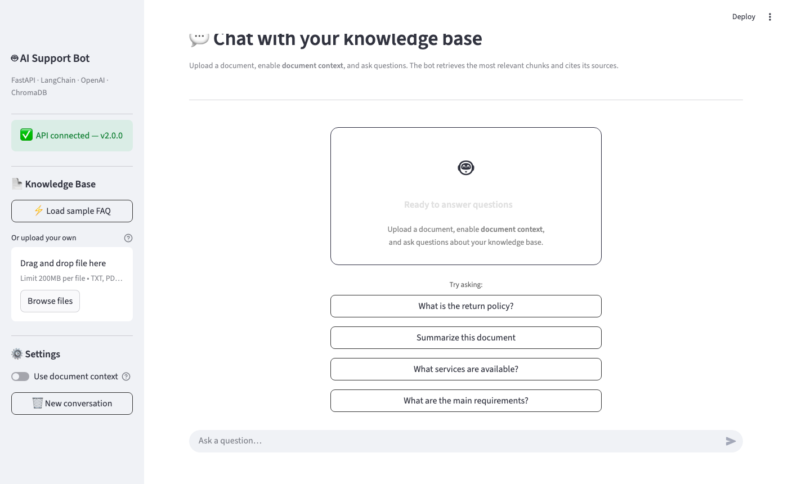
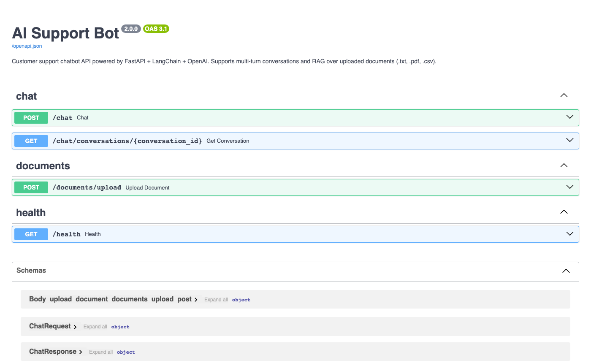

# AI Support Bot

**Customer support chatbot API built with FastAPI + LangChain + OpenAI. Multi-turn conversation memory + RAG over uploaded documents.**


---

## Current Scope — v2.0.1

**v2 adds RAG (Retrieval Augmented Generation) and a Streamlit demo UI on top of the v1 chatbot.**

What's included:
- Multi-turn conversation memory persisted in SQLite
- Document upload endpoint (.txt, .pdf, .csv) — max 10 MB
- Text extraction, chunking, and embedding via OpenAI
- ChromaDB vector store for semantic search
- `document_context=true` flag in `/chat` injects relevant chunks into the LLM prompt
- Sources returned in the chat response (filename + chunk index)
- Streamlit demo UI — upload documents and chat in the browser
- Sample FAQ document in `data/sample_faq.txt` for a quick demo
- Input validation, graceful error handling (422 / 503), no key leaks
- 58 passing tests — all LLM and embedding calls mocked

Not in this version (planned):
- WhatsApp / Twilio integration

---

## How RAG Works

```
1. Upload a document → POST /documents/upload
   ┌─────────────┐     ┌──────────────────┐     ┌──────────────┐
   │  .txt/.pdf  │────▶│ extract + chunk  │────▶│  OpenAI      │
   │  .csv file  │     │  RecursiveText   │     │  Embeddings  │
   └─────────────┘     │  Splitter        │     └──────┬───────┘
                       └──────────────────┘            │
                                                       ▼
                                                ┌──────────────┐
                                                │  ChromaDB    │
                                                │  (local)     │
                                                └──────────────┘

2. Ask a question → POST /chat  { document_context: true }
   ┌──────────────┐     ┌──────────────┐     ┌──────────────────────────┐
   │ user_message │────▶│ embed query  │────▶│  ChromaDB similarity     │
   └──────────────┘     │ OpenAI       │     │  search → top 3 chunks   │
                        └──────────────┘     └───────────┬──────────────┘
                                                         │
                                            ┌────────────▼─────────────┐
                                            │  LLM prompt:             │
                                            │  system + DOCUMENTS +    │
                                            │  history + user_message  │
                                            └────────────┬─────────────┘
                                                         │
                                            ┌────────────▼─────────────┐
                                            │  response + sources[]    │
                                            └──────────────────────────┘
```

---

## Endpoints

### `POST /documents/upload`

Upload a document to build the knowledge base.

**Request:** multipart/form-data with field `file`

Supported types: `.txt`, `.pdf`, `.csv` — max 10 MB

**Response:**
```json
{
  "document_id": 1,
  "filename": "return_policy.pdf",
  "chunk_count": 12,
  "message": "Document uploaded and indexed successfully. 12 chunks stored."
}
```

**Errors:**
| Status | Cause |
|--------|-------|
| `422`  | Unsupported file type, empty file, or no extractable text |
| `413`  | File exceeds 10 MB |
| `503`  | Embedding service unavailable (`OPENAI_API_KEY` not set or OpenAI error) |

---

### `POST /chat`

Send a message and optionally use the document knowledge base.

**Request:**
```json
{
  "user_message": "What is the return policy?",
  "conversation_id": "3f2a1b4c-...",
  "document_context": true
}
```

- `user_message` — required, 1–4000 characters
- `conversation_id` — optional (max 100 chars). Omit to start a new conversation.
- `document_context` — optional boolean (default `false`). Set `true` to search uploaded documents.

**Response:**
```json
{
  "conversation_id": "3f2a1b4c-...",
  "user_message": "What is the return policy?",
  "assistant_response": "According to the policy document, returns are accepted within 30 days...",
  "sources": [
    "return_policy.pdf (chunk 0)",
    "return_policy.pdf (chunk 3)"
  ]
}
```

- `sources` — populated only when `document_context=true`. Empty list otherwise.

**Errors:**
| Status | Cause |
|--------|-------|
| `422`  | Validation error (empty message, message too long, etc.) |
| `503`  | LLM or vector store unavailable |

---

### `GET /chat/conversations/{conversation_id}`

Retrieve the full message history for a conversation.

**Response:**
```json
{
  "conversation_id": "3f2a1b4c-...",
  "messages": [
    {"id": 1, "role": "user",      "content": "What is your return policy?", "created_at": "..."},
    {"id": 2, "role": "assistant", "content": "Returns are accepted within 30 days...", "created_at": "..."}
  ]
}
```

---

### `GET /health`

```json
{"status": "ok", "version": "2.0.1"}
```

---

## Demo UI

A Streamlit interface is included in `demo/` for easy visual testing.

### Empty state — ready to accept documents



### API — interactive docs



**Features:**
- ⚡ One-click **Load sample FAQ** for an instant demo
- Custom file upload (.txt, .pdf, .csv)
- Indexed document card with chunk count
- Inline source badges under each assistant reply
- "Use document context" toggle to switch RAG on/off
- "New conversation" to reset history

**Try it with the included sample FAQ:**

```bash
# 1. Start the API
uvicorn app.main:app --reload

# 2. In a new terminal, run the Streamlit UI
pip install streamlit httpx
API_URL=http://localhost:8000 streamlit run demo/streamlit_app.py

# 3. Open http://localhost:8501
#    Click ⚡ Load sample FAQ → enable Use document context → ask a question
```

**With Docker (API + UI together):**
```bash
docker-compose up --build
# API:  http://localhost:8000/docs
# Demo: http://localhost:8501
```

---

## Demo Flow (curl)

```bash
# 1. Upload the sample FAQ
curl -X POST http://localhost:8000/documents/upload \
  -F "file=@data/sample_faq.txt"
# → {"document_id": 1, "filename": "sample_faq.txt", "chunk_count": 18, ...}

# 2. Ask a question using the document
curl -X POST http://localhost:8000/chat \
  -H "Content-Type: application/json" \
  -d '{"user_message": "What is the return policy?", "document_context": true}'
# → {
#     "assistant_response": "Returns are accepted within 30 days...",
#     "sources": ["sample_faq.txt (chunk 0)", "sample_faq.txt (chunk 2)"]
#   }

# 3. Continue the conversation (multi-turn)
curl -X POST http://localhost:8000/chat \
  -H "Content-Type: application/json" \
  -d '{"conversation_id": "...", "user_message": "How long do refunds take?", "document_context": true}'
```

---

## Quickstart

### Docker — API + Demo UI

```bash
git clone https://github.com/Arcan17/ai-support-bot.git
cd ai-support-bot
cp .env.example .env
# Edit .env — set your OPENAI_API_KEY
docker-compose up --build
```

| Service | URL |
|---------|-----|
| API | `http://localhost:8000` |
| Interactive docs | `http://localhost:8000/docs` |
| Streamlit demo | `http://localhost:8501` |

### Local — API only

```bash
git clone https://github.com/Arcan17/ai-support-bot.git
cd ai-support-bot

python -m venv .venv
source .venv/bin/activate
pip install -r requirements.txt

cp .env.example .env
# Edit .env — set your OPENAI_API_KEY

uvicorn app.main:app --reload
```

### Local — API + Streamlit demo

```bash
# Terminal 1 — API
uvicorn app.main:app --reload

# Terminal 2 — Demo UI
pip install streamlit httpx
streamlit run demo/streamlit_app.py

# Then open http://localhost:8501 and upload data/sample_faq.txt
```

---

## Environment Variables

| Variable         | Description                                      | Default                       |
|------------------|--------------------------------------------------|-------------------------------|
| `OPENAI_API_KEY` | Your OpenAI key — required for `/chat` and RAG   | *(required)*                  |
| `OPENAI_MODEL`   | Chat model                                       | `gpt-4o-mini`                 |
| `DATABASE_URL`   | SQLAlchemy connection string                     | `sqlite:///./support_bot.db`  |
| `CHROMA_PATH`    | ChromaDB persistence directory                   | `./chroma_db`                 |
| `DEBUG`          | Enable debug mode                                | `false`                       |

> The app starts without a key. Calling `/chat` or `/documents/upload` without one returns HTTP 503 with a clear message — no crash, no stack trace.

---

## Running Tests

All OpenAI and ChromaDB calls are mocked — no API key or internet connection needed.

```bash
pytest tests/ -v
```

```
tests/test_chat.py          17 passed   ← happy path, validation, LLM errors
tests/test_chat_rag.py      16 passed   ← RAG mode, sources, vector store errors
tests/test_conversations.py  7 passed   ← GET history, multi-turn, 404
tests/test_documents.py     15 passed   ← upload .txt/.pdf/.csv, validation, 503
tests/test_health.py         3 passed   ← liveness probe
──────────────────────────────────────────────────────────
58 passed in 0.27s
```

---

## Architecture

```
ai-support-bot/
├── app/
│   ├── main.py                    # FastAPI app, lifespan, /health
│   ├── config.py                  # pydantic-settings — env vars
│   ├── database.py                # SQLAlchemy engine, session, Base
│   ├── models.py                  # Message + Document ORM models
│   ├── schemas.py                 # Pydantic v2 schemas with validation
│   ├── routers/
│   │   ├── chat.py                # POST /chat (with RAG), GET /chat/conversations/{id}
│   │   └── documents.py           # POST /documents/upload
│   └── services/
│       ├── llm_service.py         # ChatOpenAI — get_ai_response(context=...)
│       ├── document_service.py    # text extraction (txt/pdf/csv) + chunking
│       └── vector_store.py        # ChromaDB — add_chunks(), search()
├── tests/
│   ├── conftest.py                # in-memory DB + mocked LLM, search, add_chunks
│   ├── test_chat.py
│   ├── test_chat_rag.py
│   ├── test_conversations.py
│   ├── test_documents.py
│   └── test_health.py
├── .github/workflows/ci.yml
├── Dockerfile
├── docker-compose.yml
├── requirements.txt
├── .env.example
└── pytest.ini
```

---

## Tech Stack

| Layer          | Technology                               |
|----------------|------------------------------------------|
| API            | FastAPI 0.115 (async)                    |
| LLM            | LangChain 0.3 + ChatOpenAI               |
| AI model       | OpenAI GPT-4o-mini                       |
| Embeddings     | OpenAI text-embedding-3-small            |
| Vector store   | ChromaDB 0.5 (local persistence)         |
| Text splitting | LangChain RecursiveCharacterTextSplitter |
| PDF parsing    | pypdf 4.3                                |
| Database       | SQLite via SQLAlchemy 2.0                |
| Validation     | Pydantic v2                              |
| Testing        | pytest + AsyncMock                       |
| Container      | Docker + Docker Compose                  |
| CI/CD          | GitHub Actions                           |

---

## Technical Decisions

**Why ChromaDB?**  
Zero-config local persistence. No external service required — the vector store lives in `./chroma_db/`. Trivially replaceable with Pinecone or Weaviate by swapping `vector_store.py`.

**Why `text-embedding-3-small` and not `ada-002`?**  
`text-embedding-3-small` is cheaper, faster, and outperforms `ada-002` on most retrieval benchmarks. Same API, same code.

**Why inject context into the system prompt instead of as a separate message?**  
The system message is the canonical place for instructions and context. Injecting there keeps the human/assistant turn structure clean, which helps the LLM stay in the assistant role.

**Why store document metadata in SQLite separately from ChromaDB?**  
SQLite tracks which documents exist, their filenames, and chunk counts. ChromaDB stores vectors and text. Separating concerns means you can list or delete documents from a normal SQL query without touching the vector store.

---

## Freelance Use Cases

| Use case | What you configure |
|---|---|
| **Customer support bot** | Deploy as-is with a custom system prompt |
| **FAQ assistant** | Upload FAQ PDF → users chat with it |
| **HR policy assistant** | Upload employee handbook → answer policy questions |
| **Lead capture assistant** | Add lead storage to the DB schema |
| **Document QA bot** | Upload any text, PDF, or CSV → instant question-answering |
| **Internal knowledge base bot** | Upload Notion exports, manuals, or runbooks |

---

## Roadmap

- [x] Multi-turn conversation memory (SQLite)
- [x] Input validation (min/max length, 422 on bad input)
- [x] LLM error handling — HTTP 503, no key leaks, server-side logs
- [x] RAG — document upload (.txt, .pdf, .csv) + ChromaDB retrieval
- [x] Sources returned in chat response
- [x] Streamlit demo UI (upload + chat + sources)
- [x] Sample FAQ document for quick demo
- [x] Full test suite with mocked LLM + embeddings (58 tests)
- [x] Docker ready (API + demo in docker-compose)
- [x] CI/CD — GitHub Actions
- [ ] `GET /documents` — list uploaded documents
- [ ] `DELETE /documents/{id}` — remove a document and its chunks
- [ ] `/conversations` list endpoint with pagination
- [ ] Streaming responses via Server-Sent Events
- [ ] WhatsApp integration (Twilio)
- [ ] Support multiple AI providers via env var (Claude, Gemini)

---

## License

MIT
